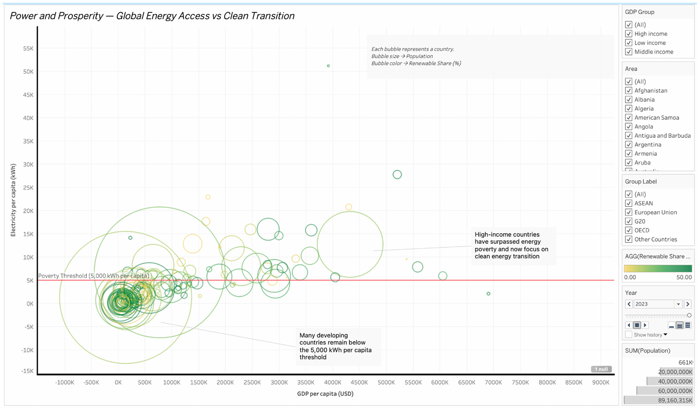

# 🌍 The Unequal Energy Divide: Power, Prosperity, and Clean Growth

## Description
This project analyzes global energy inequality by examining the relationship between GDP, electricity access, population, and renewable energy adoption. Using a multidimensional bubble chart in Tableau, the visualization highlights disparities across countries, the 5,000 kWh per capita Energy Poverty Threshold, and progress in clean energy adoption.

## Tools Used
- Tableau Desktop / Tableau Public
- Python (pandas) for data cleaning and integration
- Data Visualization & Analytics

## Key Features
- Bubble chart encoding four variables: GDP per capita (X-axis), electricity per capita (Y-axis), population size (bubble size), renewable energy share (bubble color)
- Interactive filters for GDP group, region, and year
- Tooltips displaying detailed metrics
- Threshold line to highlight energy-poor nations

## Dashboard Preview

## How to View
1. Download the `.twbx` file.
2. Open using Tableau Desktop or Tableau Public.

## Collaboration
Project completed by Vaseekaran Krishnan Vinodhan and Avinash Rajasekar as part of **CSC1143 Data Management & Visualisation (10631)**.

## References
- Ember Energy. Yearly Electricity Data. https://ember-energy.org/data/yearly-electricity-data/
- World Bank. Total Population (SP.POP.TOTL). https://data.worldbank.org/indicator/SP.POP.TOTL
- Our World in Data. GDP per Capita. https://ourworldindata.org/grapher/gdp-per-capita-worldbank-constant-usd
